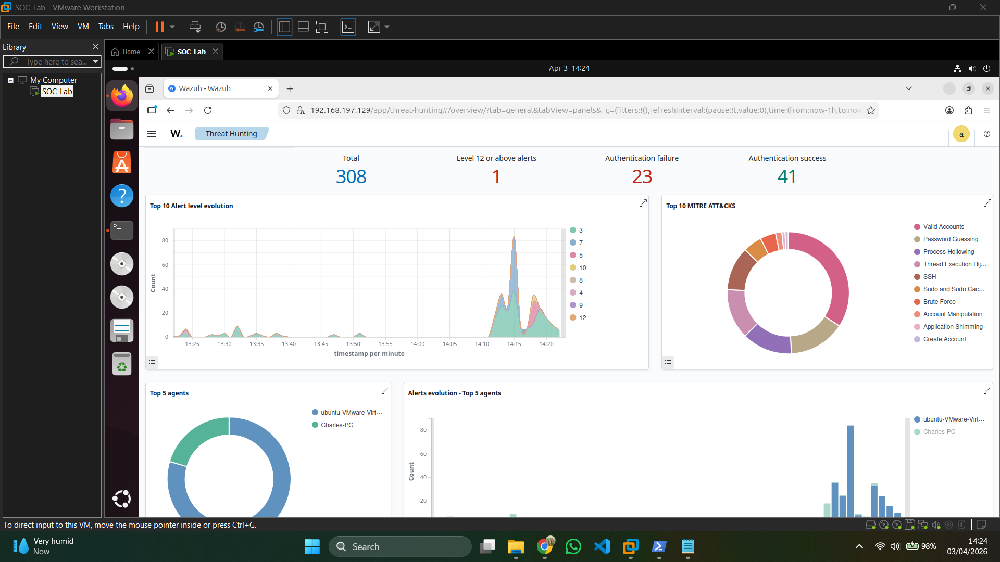
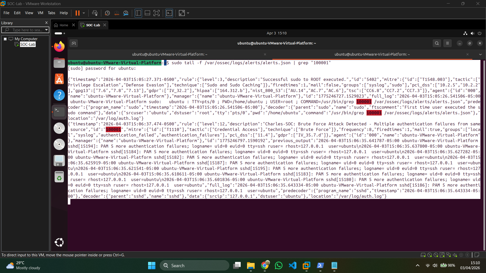
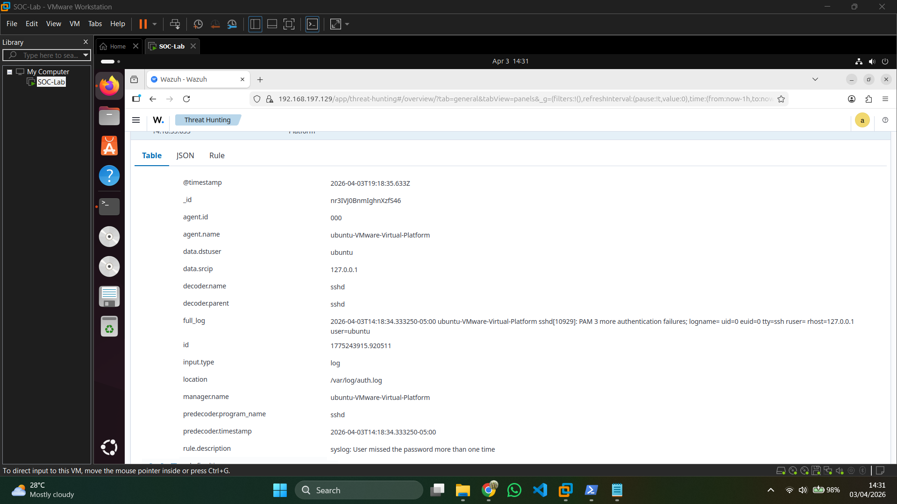

# SOC Home Lab — Threat Detection & Incident Response

**Author:** Charles  
**SIEM:** Wazuh 4.8  
**Environment:** Ubuntu Desktop 24.04 LTS (VMware) + Windows 11 Physical Endpoint  
**Status:** Complete ✅

---

## Project Overview

A fully functional Security Operations Center (SOC) home lab built from scratch, 
demonstrating end-to-end threat detection and incident response capability.

This project covers the complete SOC analyst workflow:
- SIEM deployment and agent configuration
- Endpoint log enrichment with Sysmon
- Real attack simulation and detection
- Alert triage and investigation
- Custom detection rule engineering
- Professional incident report writing

---

## Environment

| Component | Details |
|---|---|
| SIEM | Wazuh 4.8 (Manager + Indexer + Dashboard) |
| Server OS | Ubuntu Desktop 24.04 LTS |
| Endpoint | Windows 11 Pro (Physical — Wazuh Agent + Sysmon) |
| Hypervisor | VMware Workstation Pro |
| Attack Tool | Hydra (THC) |

---

## Tools & Technologies

`Wazuh` `Sysmon` `Hydra` `VMware` `Ubuntu` `Windows 11` `SSH` `MITRE ATT&CK`

---

## Project Phases

### ✅ Phase 1 — Sysmon Installation & Log Enrichment
Installed Microsoft Sysmon on the Windows endpoint using the SwiftOnSecurity 
config. Configured Wazuh agent to collect Sysmon event logs, enabling deep 
endpoint visibility including process creation, network connections, and 
file modifications.

**Skills demonstrated:** Endpoint configuration, log forwarding, SIEM integration

---

### ✅ Phase 2 — Brute-Force Attack Simulation
Simulated an SSH brute-force attack using Hydra against the Ubuntu server. 
Wazuh detected the attack and automatically mapped it to MITRE ATT&CK T1110 
(Brute Force) and T1021.004 (Lateral Movement via SSH).

**Skills demonstrated:** Threat simulation, attack pattern recognition

---

### ✅ Phase 3 — Alert Triage
Investigated the brute-force alerts in the Wazuh dashboard. Identified source 
IP, target user, attack timeline, rule chain, and compliance frameworks triggered 
(GDPR, HIPAA, PCI-DSS, NIST 800-53).

**Skills demonstrated:** SIEM navigation, alert investigation, threat hunting queries

---

### ✅ Phase 4 — Custom Detection Rule Engineering
Authored a custom Wazuh detection rule (ID 100001) that escalates to Critical 
(Level 12) when 8 or more authentication failures occur within 120 seconds. 
Rule successfully fired and appeared in the dashboard with full MITRE ATT&CK 
mapping.

**Skills demonstrated:** Detection engineering, XML rule authoring, threshold tuning

---

### ✅ Phase 5 — Incident Report
Produced a formal incident report documenting the attack, detection method, 
timeline, MITRE mapping, compliance impact, and remediation recommendations 
in professional SOC format.

**Skills demonstrated:** Incident documentation, professional communication

---

## Key Detections

| Rule ID | Level | Description | MITRE |
|---|---|---|---|
| 5760 | 5 | sshd: authentication failed | T1110.001 |
| 2502 | 10 | User missed password more than once | T1110 |
| **100001** | **12** | **Charles-SOC: Brute Force Detected (Custom)** | **T1110** |

---

## Screenshots

### Wazuh Dashboard — Attack Detection

### Custom Rule 100001 Firing

### Alert Triage — Full Details

---

## Incident Report

[📄 View Full Incident Report](Phase-5-Incident-Report/Incident-Report-INC-2026-001.md)

---

## CV Summary

> **SOC Home Lab — Threat Detection & Incident Response** | [GitHub](your-link-here)  
> Deployed Wazuh 4.8 SIEM on Ubuntu 24.04 with Windows 11 endpoint monitoring 
> via Wazuh agent and Sysmon. Simulated SSH brute-force attacks using Hydra, 
> authored custom detection rules, performed alert triage, and produced formal 
> incident reports following SOC analyst workflow.  
> *Tools: Wazuh, Sysmon, Hydra, VMware, Ubuntu, Windows 11, MITRE ATT&CK*
